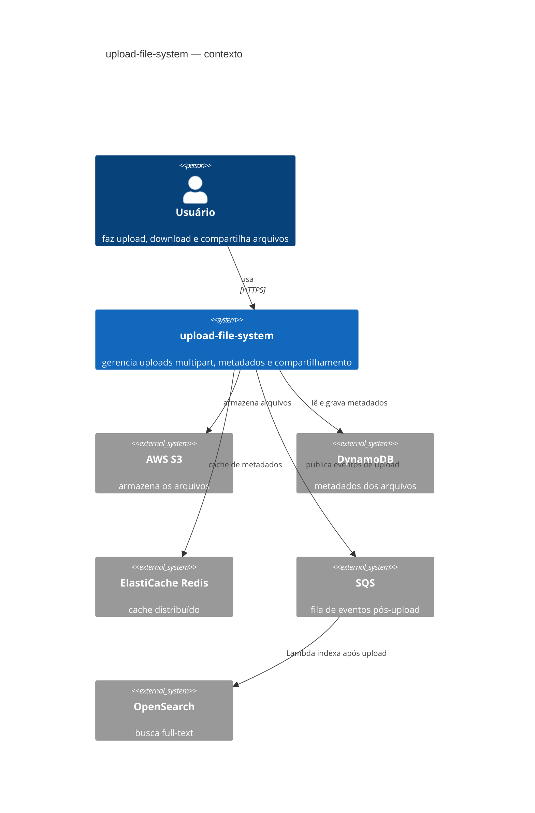
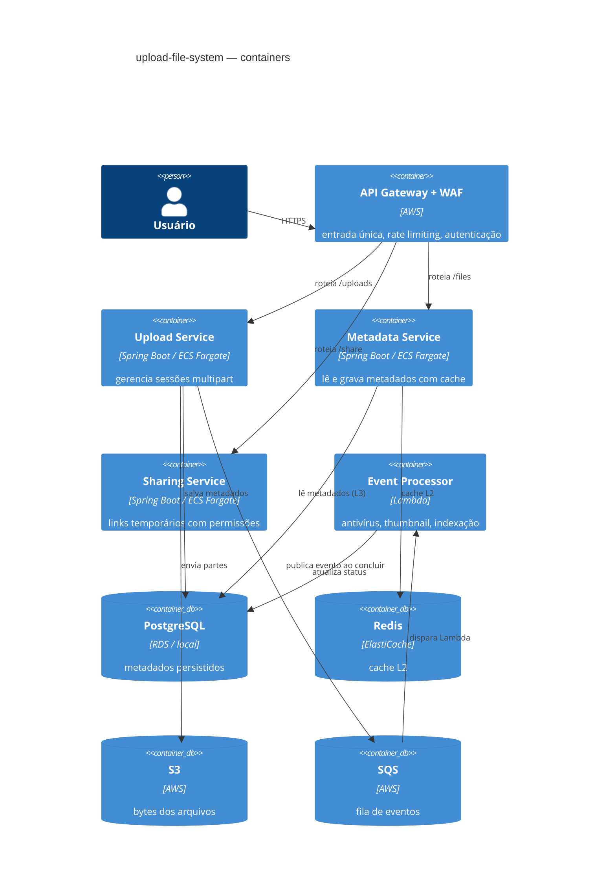
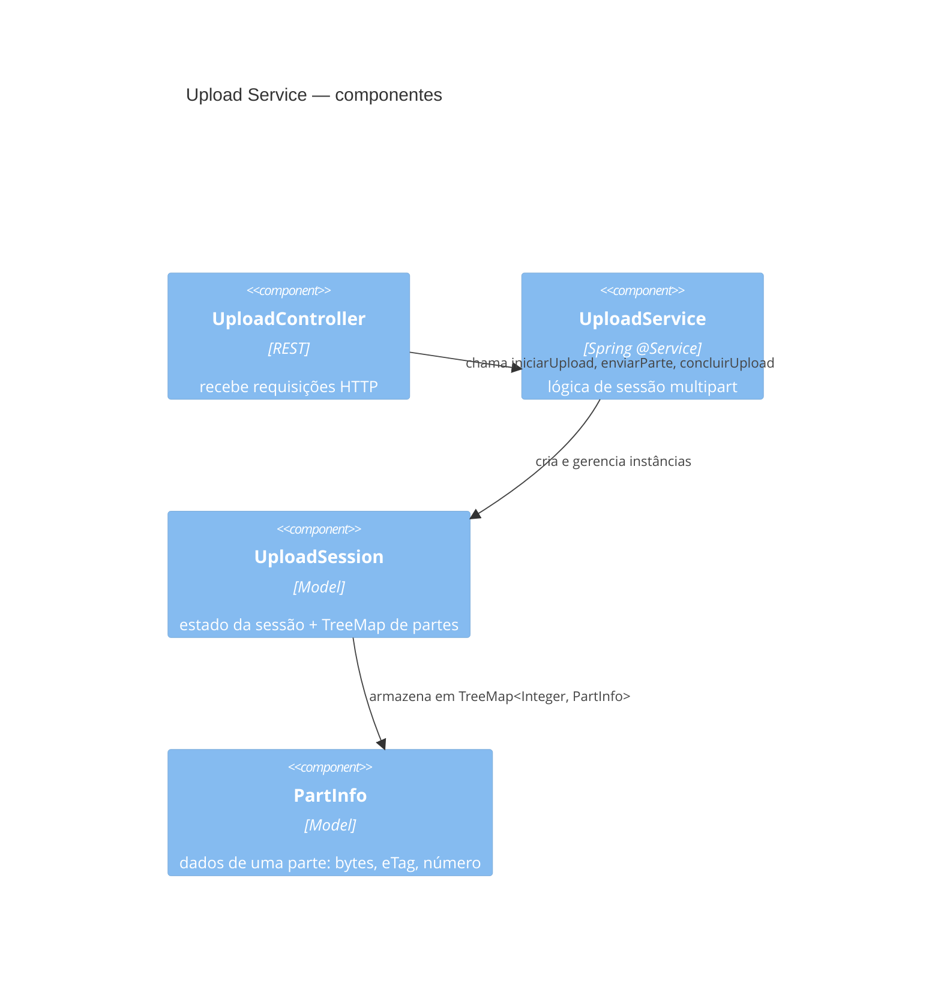
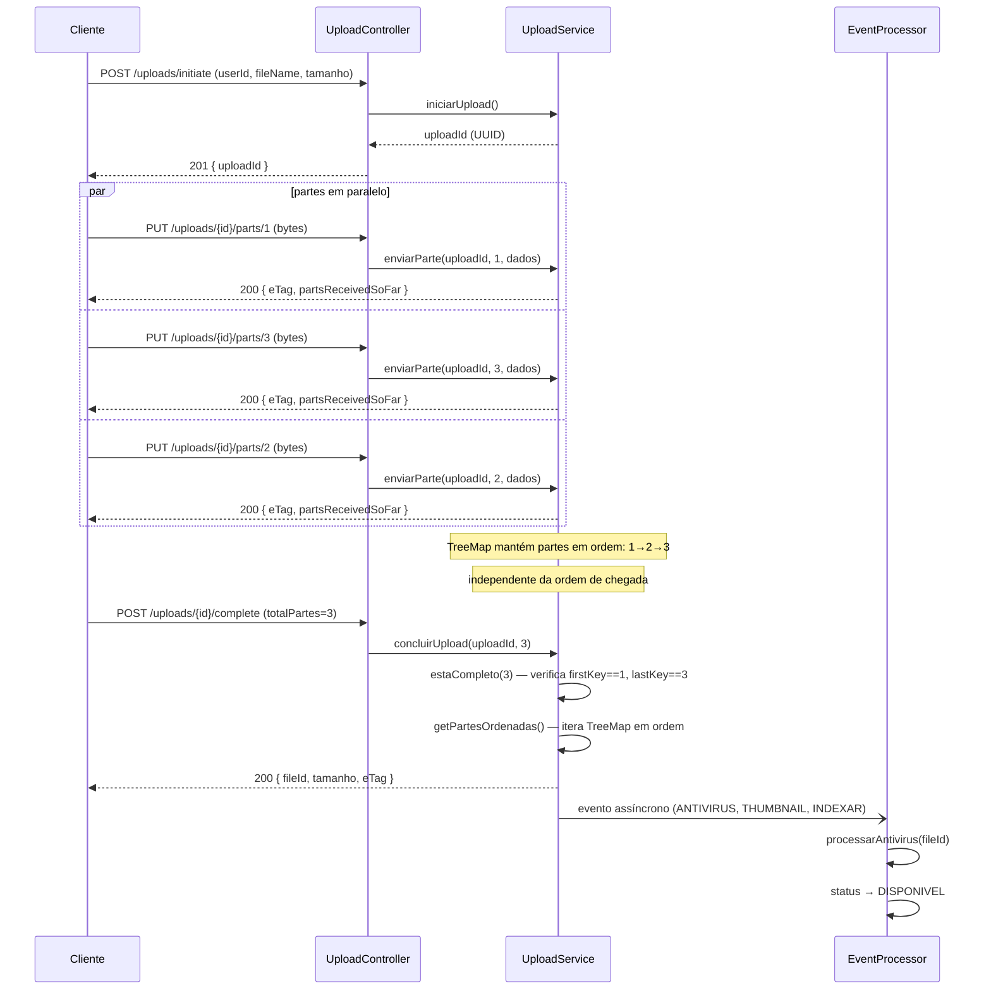
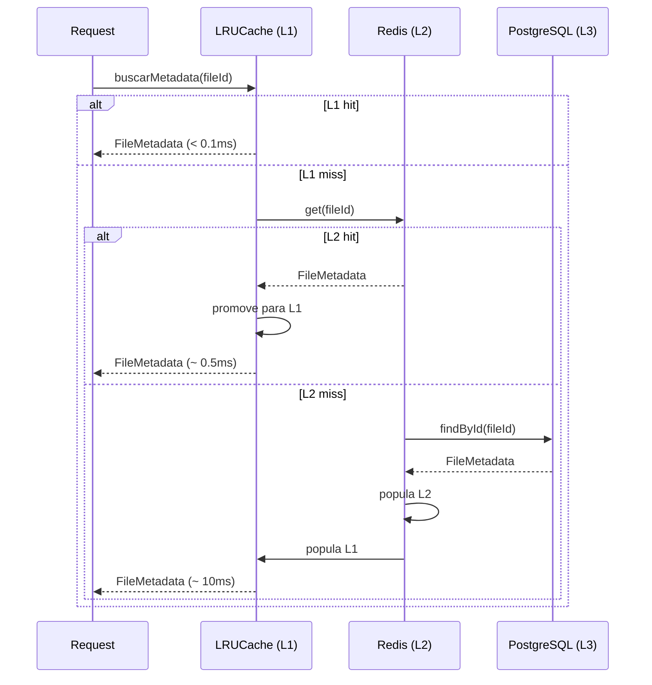
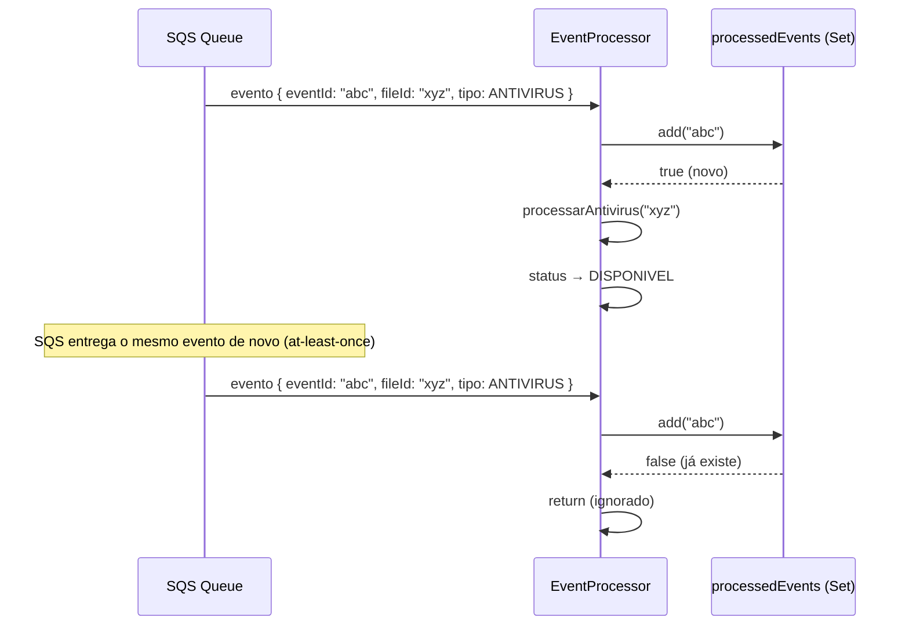
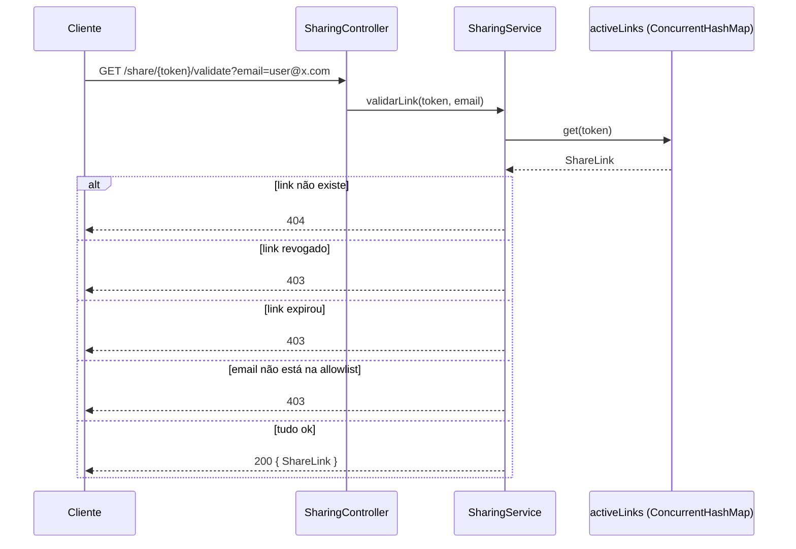
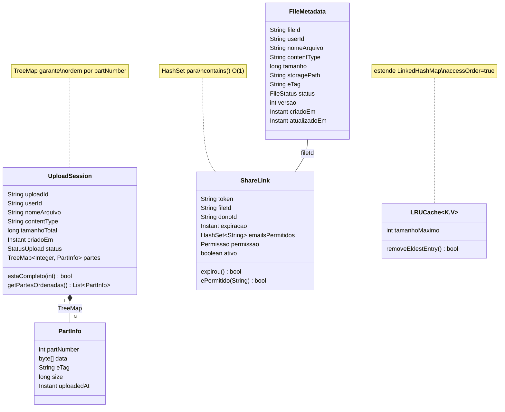
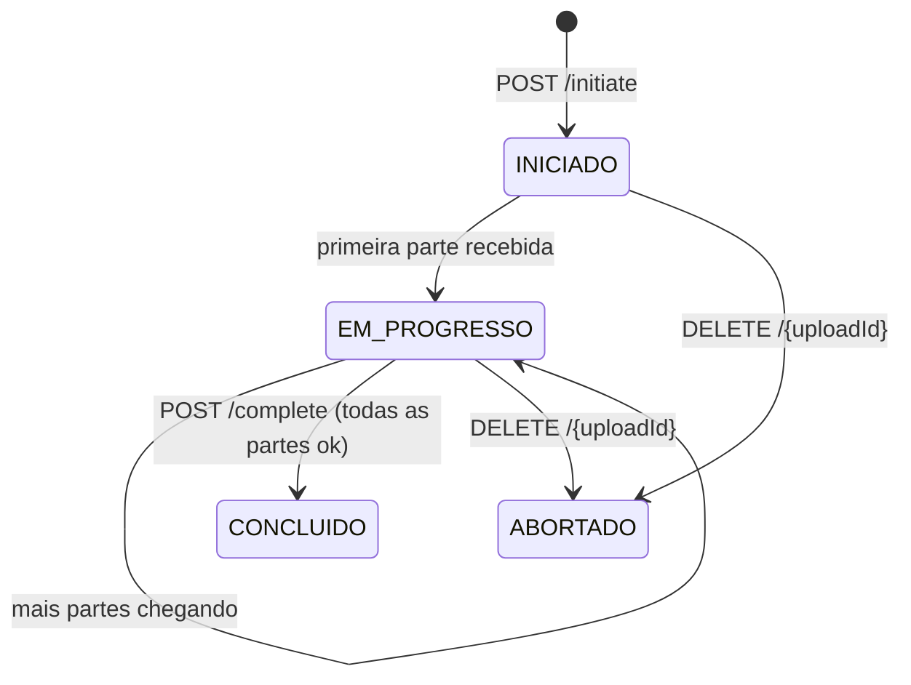
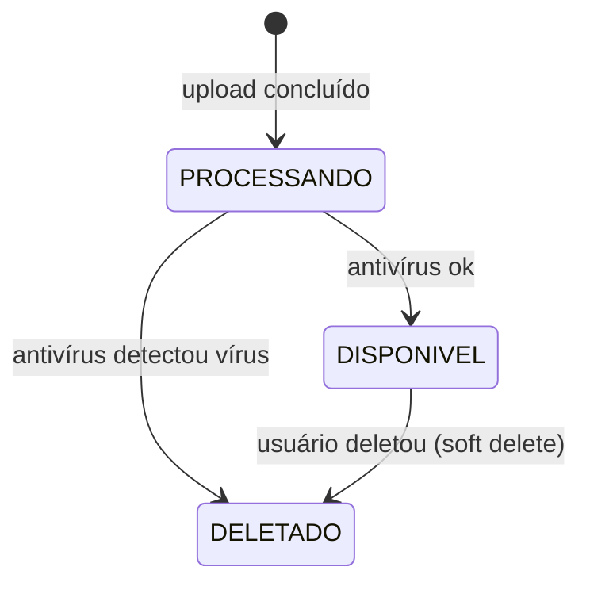

# upload-file-system — documentação técnica

---

## sumário

1. [como rodar](#como-rodar)
2. [visão geral](#visão-geral)
3. [c4 — contexto, containers, componentes](#c4)
4. [fluxos — diagramas de sequência](#fluxos)
5. [modelo de domínio — uml](#modelo-de-domínio)
6. [walkthrough do código](#walkthrough-do-código)
7. [decisões de arquitetura](#decisões-de-arquitetura)
8. [pendências](#pendências)

---

## como rodar

### com docker (recomendado)

sobe tudo: app + postgres

```bash
docker compose up --build
```

para em background:

```bash
docker compose up -d --build
```

logs da aplicação:

```bash
docker compose logs -f app
```

derrubar e limpar volumes:

```bash
docker compose down -v
```

### sem docker

precisa de postgres rodando localmente na porta 5432 com banco `uploadplatform`.

```bash
export DB_USER=postgres
export DB_PASS=postgres
mvn spring-boot:run
```

### só testes

roda com H2 em memória, sem nenhuma infra.

```bash
mvn test
```

### endpoints disponíveis depois de subir

| url | o que é |
|---|---|
| `http://localhost:8080/swagger-ui.html` | swagger com todos os endpoints |
| `http://localhost:8080/api-docs` | openapi json |
| `http://localhost:8080/actuator/health` | health check |
| `http://localhost:8080/actuator/metrics` | métricas |

---

## visão geral

plataforma para upload de arquivos grandes com suporte a multipart paralelo.
a ideia é não deixar tudo acontecer de forma síncrona no momento do upload —
o arquivo sobe, vai para fila, e o processamento pesado (antivírus, thumbnail) acontece depois.

o que o sistema faz:
- upload multipart em partes paralelas (até 5GB)
- cache em 3 níveis para leituras rápidas
- compartilhamento com links temporários e allowlist de emails
- processamento assíncrono pós-upload com idempotência

o que ainda não faz (pendências no final):
- autenticação real com jwt
- integração com s3 de verdade
- redis real com ttl
- versionamento de arquivos

---

## c4

### nível 1 — contexto



### nível 2 — containers



### nível 3 — componentes (upload service)



---

## fluxos

### upload multipart completo



### cache em 3 níveis



### idempotência no event processor



### validação de link de compartilhamento



---

## modelo de domínio

### diagrama de classes



### estados do upload



### estados do arquivo



---

## walkthrough do código

### `UploadSession.java` — o núcleo do multipart

o ponto central é o `TreeMap<Integer, PartInfo> partes`.

partes chegam fora de ordem no upload paralelo — a parte 3 pode chegar antes da 1.
o TreeMap ordena por chave (partNumber) automaticamente em cada put().
na hora de remontar, `getPartesOrdenadas()` só chama `new ArrayList<>(partes.values())` —
já vem em ordem 1, 2, 3... sem nenhum sort adicional.

`estaCompleto()` aproveita o TreeMap: `firstKey() == 1 && lastKey() == N`
confirma que não tem gap (parte faltando no meio) em O(log n).

alternativas que não usei:
- **HashMap** — O(1) no put, mas iteration order indefinida. precisaria de sort extra na remontagem
- **ArrayList por índice** — precisaria pre-alocar e lidar com posições vazias
- **LinkedHashMap** — preserva ordem de inserção, não de chave. parte 3 inserida antes da 1 ficaria errada

---

### `UploadService.java` — gerencia sessões

`ConcurrentHashMap<String, UploadSession> uploadsAtivos` —
múltiplos uploads simultâneos significam múltiplas threads no mesmo map.

alternativas descartadas:
- `HashMap` — não é thread-safe. concurrent writes corrompem o estado interno
- `Collections.synchronizedMap(new HashMap<>())` — thread-safe mas com lock global. todas as threads esperando umas às outras
- `Hashtable` — legacy, mesmo problema do lock global

o `ConcurrentHashMap` usa lock por segmento (bucket). threads em uploads diferentes operam em paralelo.

`putIfAbsent` no `iniciarUpload` é atômico: se dois threads gerarem o mesmo UUID (astronomicamente improvável), só um vence.

`remove(uploadId, session)` no `concluirUpload` é atômico também: remove só se o valor atual for exatamente aquela sessão. previne race condition onde dois requests de complete competem pelo mesmo upload.

dentro de cada sessão ainda tem `synchronized (sessao)` nas operações com o TreeMap — porque TreeMap não é thread-safe, e partes diferentes do mesmo upload podem chegar em threads diferentes.

---

### `LRUCache.java` — cache local L1

estende `LinkedHashMap` com `accessOrder=true`.

o que `accessOrder=true` faz: cada vez que você chama `get(key)` ou `put(key, value)`,
o entry é movido para o final da lista interna do LinkedHashMap.
o entry no início é sempre o menos recentemente usado.

`removeEldestEntry` é chamado automaticamente após cada `put`.
quando `size() > tamanhoMaximo`, o entry da cabeça (LRU) é removido.

tudo isso acontece em O(1) — LinkedHashMap mantém ponteiro para head e tail da lista.

por que não Caffeine ou Guava Cache em produção?
porque têm TTL, métricas, refresh assíncrono, eviction policies mais ricas.
o LRUCache com LinkedHashMap é o mecanismo por baixo — bom para entender, suficiente para volume baixo.

todos os métodos são `synchronized` porque LinkedHashMap não é thread-safe.
o lock é no próprio objeto do cache. para L1 (cache local da instância) a contenção é baixa —
a maioria das requisições são L1 hit que resolvem rápido.

---

### `MetadataService.java` — cache em 3 níveis

o fluxo de leitura:
```
buscarMetadata(fileId)
  → cacheLocal.get(fileId)     — L1, LRU, in-process, ~0ms
      miss → cacheRedis.get()  — L2, simulação do Redis, ~0.5ms em prod
                miss → repository.findById() — L3, banco, ~10ms
                       → popula L2 e L1
```

na escrita/deleção, `invalidarCache()` remove de L1 e L2.
a próxima leitura vai ao banco e repopula com a versão atualizada.

`listarArquivos` usa `TreeMap<Instant, FileMetadata>` para paginação por cursor.
cursor-based pagination é mais eficiente que offset — `LIMIT x OFFSET y` piora quanto maior o offset.
com TreeMap, `headMap(cursor, false)` retorna tudo antes do cursor em O(log n).

`agruparPorStatus` usa `Collectors.groupingBy` com `EnumMap` como factory.
EnumMap é um array indexado pelo ordinal do enum — sem hashing, sem colisão, O(1) garantido.
a ordem de iteração segue a declaração do enum: PROCESSANDO → DISPONIVEL → DELETADO.

---

### `EventProcessor.java` — idempotência

`Set<String> eventosProcessados = ConcurrentHashMap.newKeySet()`

SQS é at-least-once: o mesmo evento pode ser entregue mais de uma vez.
`Set.add(eventId)` retorna `false` se já existia — check-and-mark atômico em uma operação.

por que `ConcurrentHashMap.newKeySet()` e não `Collections.synchronizedSet(new HashSet<>())`?
synchronizedSet usa lock global — todas as threads esperando no mesmo monitor.
ConcurrentHashMap divide em segmentos — threads em eventIds diferentes operam em paralelo.

`retryCount.merge(eventId, 1, Integer::sum)` é atômico no ConcurrentHashMap.
incrementa o contador de tentativas sem synchronized externo.

---

### `SharingService.java` — links temporários

`ConcurrentHashMap<String, ShareLink> linksAtivos` —
validação de token é o caminho mais quente do serviço, chamada em todo download.
O(1) com lock striping.

`ShareLink` usa `HashSet<String> emailsPermitidos`:
a operação dominante é `contains(email)` — O(1) no HashSet.
List seria O(n). para 100 emails permitidos: 100 comparações vs ~1 no HashSet.

`getLinkStats()` mostra `Collectors.groupingBy` com `Collectors.counting()`:
agrupa links por fileId e conta quantos cada arquivo tem.
retorna `Map<String, Long>` — a interface, não HashMap. o caller não precisa saber a implementação.

---

### `GlobalExceptionHandler.java` — tratamento de erros

`LinkedHashMap<String, String> errosCampos` nos erros de validação.
LinkedHashMap preserva ordem de inserção — os campos aparecem no JSON na mesma ordem
que foram declarados no DTO. mais legível para quem está debugando.
HashMap retornaria ordem arbitrária. TreeMap retornaria ordem alfabética — nem sempre faz sentido.

`putIfAbsent` para cada campo: mantém o primeiro erro por campo, ignora erros subsequentes do mesmo campo.

---

### `FileMetadata.java` — entidade JPA

`equals()` e `hashCode()` baseados só no `fileId`.

se eu usasse campos mutáveis como `status` no hashCode, um FileMetadata em estado PROCESSANDO
e o mesmo arquivo em DISPONIVEL teriam hashes diferentes.
resultado: HashMap "perde" o entry porque o bucket mudou. bug silencioso, difícil de encontrar.

fileId é imutável (UUID gerado uma vez, `updatable = false` na coluna), então é seguro como base.

`@Version` habilita optimistic locking no Hibernate: quando dois requests tentam atualizar
o mesmo arquivo ao mesmo tempo, o segundo falha com `OptimisticLockException`
em vez de silenciosamente sobrescrever o primeiro. sem isso, race conditions em updates concorrentes.

`@Enumerated(EnumType.STRING)` — o status é salvo como string ("DISPONIVEL") em vez de ordinal (1).
se eu mudar a ordem dos enums, o ordinal do banco ficaria errado. com STRING, não tem esse risco.

---

## decisões de arquitetura

### por que não monolito?

para esse volume (10M usuários, 1B arquivos), os componentes têm requisitos diferentes:
- upload consome CPU e memória intensamente
- leituras de metadados são 100x mais frequentes que uploads
- processamento (antivírus) pode ser lento e não precisa bloquear o upload

separando, cada serviço escala de forma independente.

dito isso: para um projeto em estágio inicial, monolito com PostgreSQL + S3 resolve os mesmos requisitos funcionais com muito menos complexidade operacional.
microserviço faz sentido quando o time cresce ou quando os requisitos de escala forçam.

### DynamoDB vs PostgreSQL

usei PostgreSQL aqui (mais fácil de rodar localmente).
em produção na AWS, DynamoDB seria melhor para metadados de arquivo porque:
- padrão de acesso é lookup por `userId + fileId` — single-table design funciona
- escala horizontal automática sem ops
- latência de single-digit ms

PostgreSQL/Aurora faria mais sentido se precisasse de JOINs complexos —
por exemplo, relatórios cruzando usuários, arquivos, permissões e auditoria.

### cursor-based vs offset pagination

offset pagination:
```sql
SELECT * FROM file_metadata ORDER BY criado_em DESC LIMIT 20 OFFSET 100
```
- piora com offset maior: banco escaneia e descarta os 100 primeiros a cada request
- instável: se alguém inserir um arquivo enquanto você navega, você pula ou repete registros

cursor-based:
```sql
SELECT * FROM file_metadata WHERE criado_em < :cursor ORDER BY criado_em DESC LIMIT 20
```
- O(log n) com índice na coluna de data
- estável: novos arquivos não afetam páginas já navegadas
- desvantagem: não dá para ir diretamente para "página 5"

### soft delete vs hard delete

arquivos deletados ficam com status DELETADO no banco.
a remoção física no S3 é assíncrona (job de limpeza não implementado ainda).
motivos:
- auditoria: saber quem deletou o quê e quando
- billing: calcular uso histórico de storage
- recovery: janela de 30 dias para restaurar acidentalmente deletados

### por que validação com Bean Validation nos DTOs

as annotations `@NotBlank`, `@Min`, `@Size` nos DTOs são checadas antes de chegar no service.
o service pode assumir os invariantes sem fazer validação manual.
o GlobalExceptionHandler captura `MethodArgumentNotValidException` e devolve 400 com detalhe por campo.

---

## pendências

### segurança (crítico)
hoje o `userId` vem no request body — qualquer um pode forjar.
o correto é extrair do JWT após autenticação.
precisa: Spring Security + JWT filter + Cognito ou similar.

### integração real com S3
hoje as partes ficam em memória (`byte[]` no PartInfo).
para arquivos grandes isso estoura o heap.
precisa: AWS SDK S3, streaming direto para S3 sem materializar em RAM, presigned URLs.

### redis real com TTL
o `cacheRedis` é um `ConcurrentHashMap` — não tem TTL, não compartilha entre instâncias.
precisa: Spring Data Redis, `RedisTemplate`, TTL configurável por key.

### versionamento de arquivos
fazer upload de um arquivo com o mesmo nome deve criar uma versão nova, não sobrescrever.
precisa: campo `versao` no FileMetadata, endpoint para listar versões, restaurar versão anterior.

### docker compose com redis
adicionar redis no docker-compose para o cache L2 ficar funcional localmente.

### upload resumível
se a conexão cair no meio de uma parte grande, a parte toda é perdida.
protocolo TUS resolve isso — upload resumível com offset dentro da parte.
importante para mobile em redes instáveis.

### deduplicação por hash
calcular SHA-256 do arquivo antes do upload.
se já existe um arquivo com o mesmo hash, não faz upload de novo — só cria novo metadado apontando para o mesmo objeto no S3.
economiza 30-40% de storage em bases corporativas.

### job de limpeza
deletar fisicamente do S3 os arquivos com status DELETADO há mais de X dias.
e limpar links de compartilhamento expirados do mapa em memória periodicamente (`@Scheduled`).
